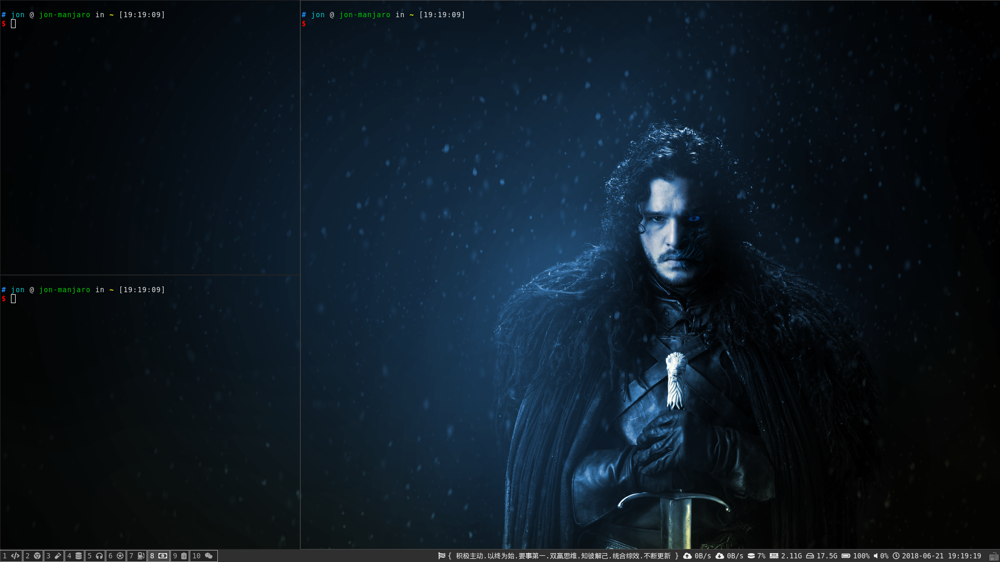

# my-i3
我的自定义i3-wm快捷键配置, 默认配置的jkl;使用和vim的hjkl存在差异，使用上容易混淆，所以把快捷键改为统一意义。同时把冲突的 mod + h  改到c键上。
`顺便安利一句： i3-wm 平铺窗体管理器，真心好用.`



## 与默认配置的变更
- 把所有的 jkl; 变更为 hjkl
- 把 mod + h  变更为 mod + c

## 使用
1. 先安装附加软件
2. 安装字体
3. 把config文件的内容覆盖 ~/.config/i3/config 
4. 修改其中的两个图片路径

## 附加安装的软件
- rofi
- i3lock
- conky
- xclip
- feh
- deepin-screenshot

## 字体安装方法
1. 拷贝字体文件夹到 /usr/share/fonts/目录下
2. 执行fc-cache -fv

## 快捷键列表

|按键|操作|
|---|---|
|mod+number|切换工作区|
|mod+Shift+number|移动到工作区|
|mod+h,j,k,l|焦点向左，下，上，右移动|
|mod+d|打开rofi菜单|
|mod+x|关闭窗体|
|mod+Return|打开终端|
|mod+c,v|横向，垂直分割|
|mod+f|全屏|
|mod+s,w,e|多种排列方法|
|mod+Shift+space|浮动|
|mod+a|焦点移动到上一层|
|mod+Shift+c|Reload|
|mod+Shift+r|Restart|
|mod+Shift+e|注销|
|mod+r|设定窗体占比大小|
|mod+m|锁定桌面|
|mod+Control+a|截图|

## 其他

### 网络速度显示

在conkyrc_bar配置中， 调整upspeed和downspeed后的网卡名称， 查看网卡名称的方法

```
cat /proc/net/dev
```

### 关于使用Awesome字体的方式

在bar 中增加font 项，
在配置中使用像  &#xf120; 来表达。

